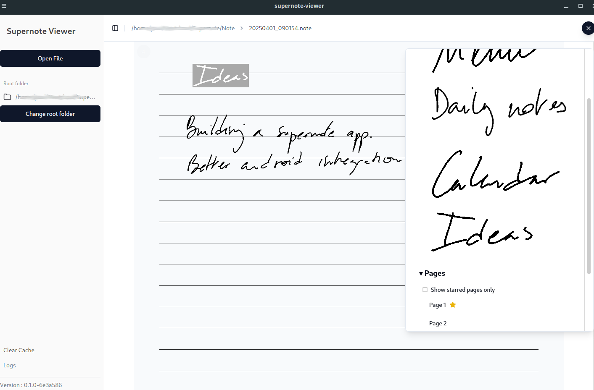

# Supernote Viewer    

A comprehensive solution for working with Supernote files, consisting of two applications:

1. **Supernote Viewer App** - A desktop/mobile application for viewing and interacting with Supernote files
2. **Supernote CLI** - A command-line tool for extracting and processing Supernote files



## Supernote Viewer App

The Supernote Viewer is a Tauri + React application that allows you to:

- View Supernote files with full menu and navigation support
- Access links and starred pages within notes
- Browse through multi-page documents with a responsive interface
- Utilize a smart caching system that only extracts new or updated pages

## Supernote CLI

The CLI tool is designed for automated workflows and integration with other tools:

```
supernote-cli --extract <input_file> --generate-md <md_output_path> --media-folder <folder_path>
```

Key features:
- Extract images from Supernote files or PDFs with marks
- Generate markdown files with links to extracted images
- Efficiently manage planners split by days/months
- Support for daily reflection journaling
- Perfect for use in cron jobs to automatically update Obsidian vaults

## Recommended IDE Setup

- [VS Code](https://code.visualstudio.com/) + [Tauri](https://marketplace.visualstudio.com/items?itemName=tauri-apps.tauri-vscode) + [rust-analyzer](https://marketplace.visualstudio.com/items?itemName=rust-lang.rust-analyzer)

## Quick Start

### 0. Synchronize supernote-typescript submodule

```bash
git submodule init
git submodule update
```

### 1. Install Prerequisites

Install Rust and system libraries: https://v2.tauri.app/start/prerequisites/

```bash
sudo apt-get install -y build-essential libcairo2-dev libpango1.0-dev libjpeg-dev libgif-dev librsvg2-dev libpixman-1-dev graphicsmagick
```

### 2. Install Node dependencies

```bash
npm i
```

### 3. Build both applications

```bash
# Build the TypeScript library
cd supernote-typescript
npm i && npm run build
npm link supernote-typescript
cd ..
npm link

# Build the applications
npm run build        # Build the Tauri app
npm run build:cli    # Build the CLI tool
npx tauri build      # Package the Tauri app
```

### 4. Using the CLI

After building, you can use the CLI tool:

```bash
# Extract images from a Supernote file and generate markdown
npx supernote-cli --extract path/to/note.note --generate-md output.md --media-folder ./images

# Use in a cron job (example)
# 0 * * * * /path/to/node /path/to/supernote-cli --extract /path/to/planner.note --generate-md /path/to/obsidian/planner.md --media-folder /path/to/obsidian/assets
```

## Acknowledgements

Special thanks to the developer of the original supernote-typescript module that was forked for this project. The fork includes fixes and small modifications to enhance functionality and compatibility with the Supernote Viewer application.
